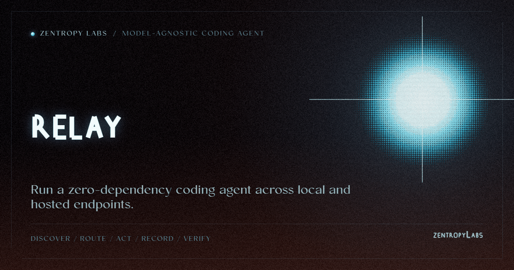

<p align="center"></p>

# relay

**A zero-dependency, accountable coding agent that runs on any model endpoint.**
Local models when you're offline, your subscription or API when you need more,
automatic failover across all of them, and every run is a re-verifiable,
git-anchored trajectory. Stdlib only.

```
pip install git+https://github.com/HarperZ9/relay.git

relay --health --online                    # which model tiers are live?
relay "explain this function" --file app.py
relay --agent "fix the off-by-one in paginate()" --root . --allow-write --auto-commit
relay --mcp                                # serve the agent to any MCP client
```

## Reaches every endpoint (with your own credentials)

One ladder, tried in order, failing over on exhaustion or error, free/private
tiers first so you only spend metered tokens when you have to:

| Tier | Reached by |
|---|---|
| **local** | a served 14B/32B (`serve.py`) → Ollama (largest pulled model) |
| **plan / max** | the official CLI (`claude`, `codex`) using your subscription auth |
| **api** | `codex` / `claude` / `glm` / `gemini` / `deepseek` public APIs + `<PROVIDER>_API_KEY` |
| **provider** | a gateway (OpenRouter, ...) via `<PROVIDER>_PROVIDER_BASE_URL` |
| **cloud** | a cloud OpenAI-compatible endpoint via `<PROVIDER>_CLOUD_BASE_URL` + `_CLOUD_KEY` |

Legitimate by construction: keys come from the environment, subscriptions from
your own authenticated CLI, gateways from a base URL you set. Nothing is forged,
no cover identity is minted, no session token is harvested, no billing is evaded.
A missing credential just drops that tier from the ladder.

## An actual coding agent, not a chat box

`--agent` runs a permission-checked tool loop the model drives:

- **`repo_map`**: a compact code outline (Python via `ast`; JS/TS/Go/Rust/Java/
  C#/Swift/PHP/Ruby via patterns) so the model finds the right file.
- **`edit_file`**: precise search/replace where the target must match exactly
  once, so an ambiguous edit is refused, not guessed.
- **`read_file` / `list_dir`**: confined to `--root`.
- **`write_file`**: off by default; enabled with `--allow-write`; confined to `--root`.
- **`run`**: off by default; enabled with `--allow-exec`. A shell can write, so
  `--allow-exec` implies write, and unlike the file tools `run` is not confined to
  `--root` (it sets only the working directory). A denylist refuses a few literal
  destructive spellings: a guardrail against a small model wrecking the tree, not
  a security boundary.

## The wedge: a provable run

Every turn, tool call, and result is appended to a **hash-chained session
ledger**. A saved run is tamper-evident: reload it and `verify()` re-derives the
chain (a broken chain is refused, not loaded). With `--auto-commit`, relay stages
only the files the ledger recorded as edits and carries the checkpoint in the
message, so the commit binds the witnessed edit set; unrelated or shell-written
working-tree changes are left out, never attributed to the run. Each model turn
also carries a content-addressed receipt whose id a stranger can re-derive from
the saved record. No other coding agent gives you a run you can *prove*, not just
read.

## Prove it works, not just that it ran

A witnessed trajectory proves *what* the agent did. It does not prove the edits are
*correct*: a model can finish confidently and leave a broken tree. Pass `--check`
and relay closes that gap: after the agent finishes, it runs your acceptance command
once, witnesses the result on the ledger, and **accepts** the run only if it passes.

```bash
relay --agent "fix the failing test in paginate()" --root . --allow-write \
      --check "pytest -q" --auto-commit
```

The check carries *your* authority, not the model's: it runs outside the tool
permission boundary and is never a call the model can emit or steer. A failed check means the run is not
accepted, `--auto-commit` is skipped (a broken tree is never committed on your
behalf), and the exit code is non-zero, so `--agent --check` works as a CI check over the
agent's own work. `accepted` = a provable trajectory whose acceptance check held.

And the pass has to be *earned*. A rule-based reward-hacking guard reads the
witnessed edit set: if the agent made the check green by editing the test that grades
it, or by injecting a `pytest.skip` / `sys.exit`, the pass is flagged UNTRUSTED and
the run is not accepted. A gamed green is never committed. The flags ship with the
run under their own hash, re-checkable; the guard is non-learned and only ever turns
an accept into a refusal, never the reverse.

## Prove the boundary holds (prompt-injection robustness)

Third-party data an agent reads (a file, a webpage, a tool result) can carry an
instruction that tries to make it exfiltrate, overwrite, or escape. relay's defense
is the boundary: tool output is data, never a command, and writes and exec are off by
default. `relay --probe-injection` measures that defense. It runs a fixed,
inspectable corpus of injection scenarios through the permission-checked executor, assuming the
worst case that the model was fully fooled and emitted exactly the smuggled call,
and reports **containment** with a re-derivable receipt. It exits non-zero if any
scenario is not contained, so it works as a CI check.

```bash
relay --probe-injection                 # safe default: every injection contained
relay --probe-injection --allow-exec    # honest: an open shell is a superset capability
```

It generates no attacks (the corpus is readable data) and it can fail, so it is a
real measurement, not a reassurance. Harden the defender, measure it, feed the
failures back.

## A run a reviewer can read

Every `--agent` run also ships a **reviewability projection** derived purely from the
witnessed ledger, in the terms a senior reviewer checks first: which files were
`edited_unread` (changed without ever being read), which edits no passing check
covered (`unverified_edits`), the failed-call scars, and a `reviewability` score over
read-before-write, verified, and clean-call ratios. Alongside it, a `risk` table tiers
each edit by mechanical signals (lines, nesting depth, branching, duplicate lines);
a high-tier edit **demands** a stronger receipt. These are facts, never generated
prose, so a surface can enforce them. Expert reviewers get the middle of the run, not
just its ending.

## Use from an agent (MCP)

`relay --mcp` is a zero-dep stdio MCP server exposing `local_agent_health`,
`local_agent_chat`, and `local_agent_run`. Point Claude Code (or any MCP client)
at it to use relay as a fallback tier, e.g. keep working on local models when a
hosted quota runs out.

## Library

```python
from relay import LocalAgent, available_backends, build_endpoints, run_agent

agent = LocalAgent(backends=available_backends() + build_endpoints())  # local + online
print(agent.send("hi")["content"][0]["text"])
```

## License

MIT. See [LICENSE](LICENSE).

## What this believes

This tool is one part of a family that holds a single belief steady across
every surface: knowledge open to anyone who can attain the means; acceptance
decided by external checks, never reputation; every result re-runnable;
honest nulls first-class; ownership earned by comprehension; learning woven
into the work. The full text lives in [CREDO.md](CREDO.md).
The long form of this belief: [The Unbundling](https://github.com/HarperZ9/flywheel/blob/fix/release-model-identity/docs/essays/2026-07-13-the-unbundling.md).

---

**[Zentropy Labs](https://github.com/ZentropyLabs-ai)** · order out of entropy. An independent lab building evidence-first tools that leave a re-checkable artifact behind. Built by Zain Dana Harper in Seattle. The full workbench is at [Project Telos](https://harperz9.github.io).
